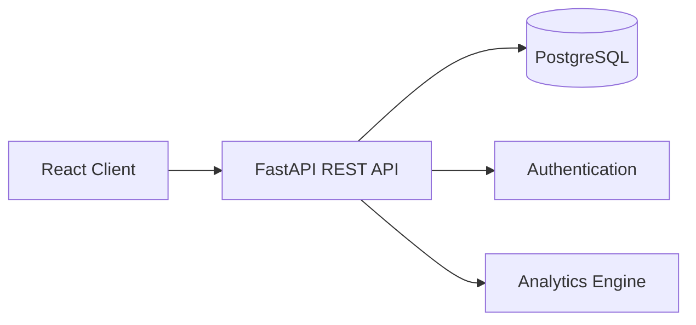
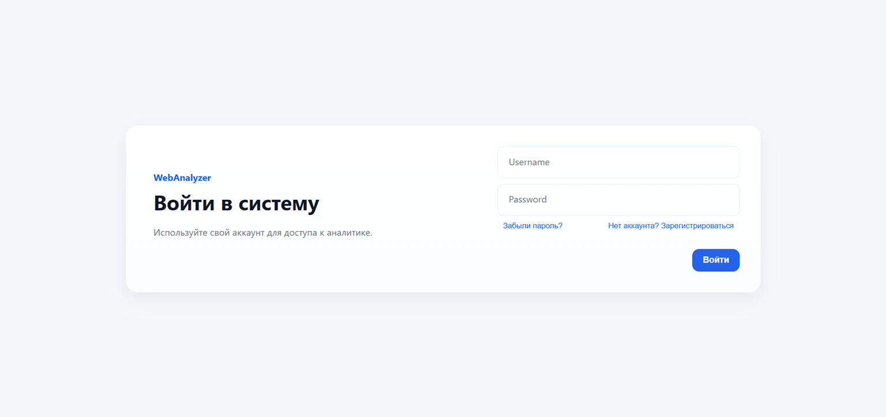
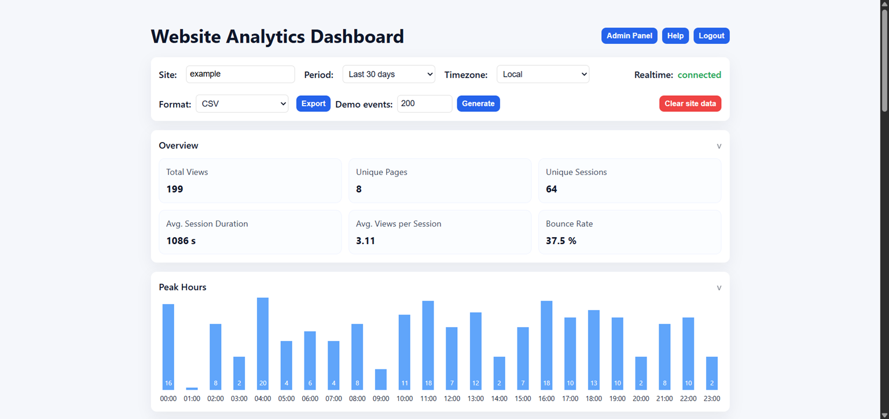
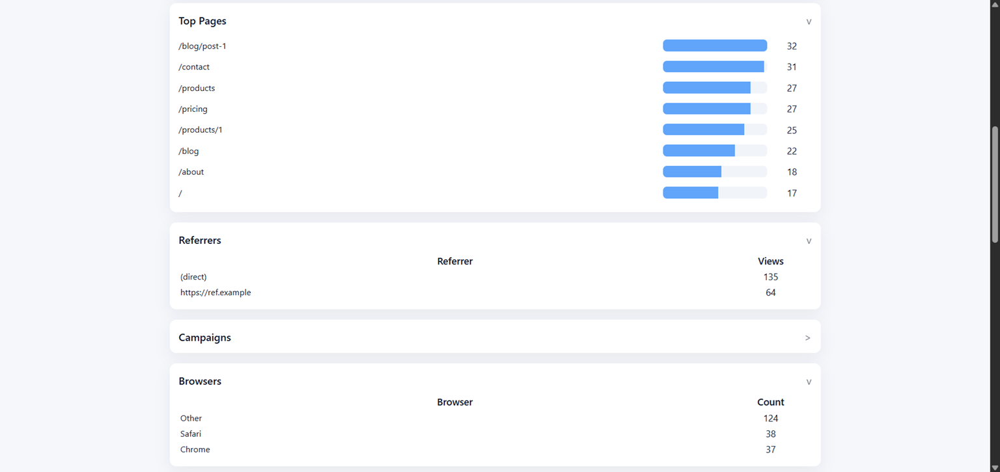
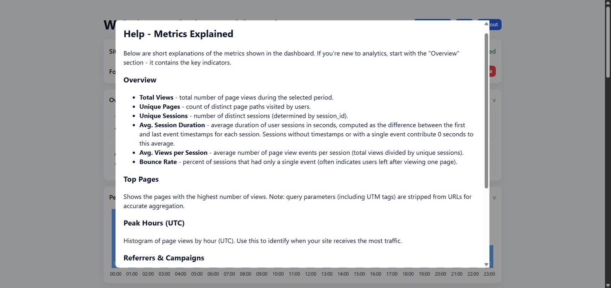
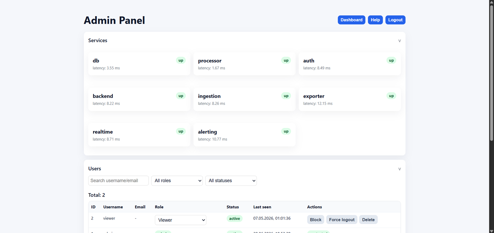
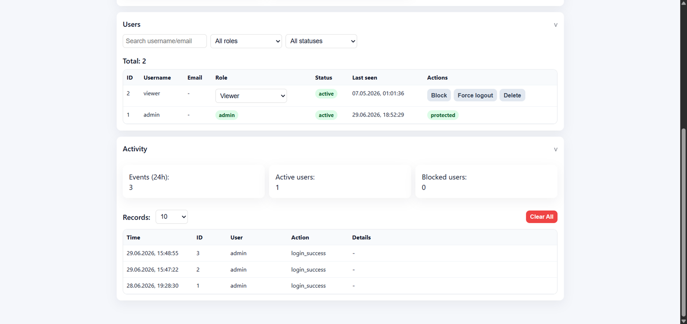

# 📊 Web Platform Usage Analytics System

A full-stack web application for collecting, analyzing, and visualizing user activity across a web platform.

The project was developed as a graduation thesis and focuses on transforming raw user events into meaningful analytics through a scalable client-server architecture.

## 📌 Why This Project

* Demonstrates full-stack software development
* Shows scalable client-server architecture
* Presents practical implementation of web analytics and reporting
* Emphasizes modular design and maintainable code

## ⚙️ Tech Stack

### Backend

* Python
* FastAPI
* SQLAlchemy
* PostgreSQL

### Frontend

* React
* TypeScript
* Tailwind CSS

### Infrastructure

* Docker
* Docker Compose

## ✨ Feature Overview

* User authentication and authorization
* Activity tracking and event collection
* Analytics dashboard
* Interactive charts and reports
* User and role management
* REST API for client-server communication

## 🏗 Architecture

The application follows a modular client-server architecture:

* Frontend: React-based user interface
* Backend: FastAPI REST services
* Database: PostgreSQL
* Infrastructure: Docker-based deployment



## 🚀 Quick Start

```bash
docker compose up --build
```

The application will start all required services, including the backend, frontend, and database.

## 📸 Demonstration

### Secure authentication interface for accessing the system.



### Main dashboard presenting key usage analytics and system overview metrics.



### Extended analytics view with deeper statistical insights.



### Informational screen providing detailed explanations of all analytics metrics and their meaning within the system.



### Administrative interface for system configuration and management.



### Overview of user accounts and their activity logs across the platform.



## 🎯 Learning Outcomes

* Full-stack application development
* REST API design
* Database modeling
* Containerized deployment
* Modular software architecture
